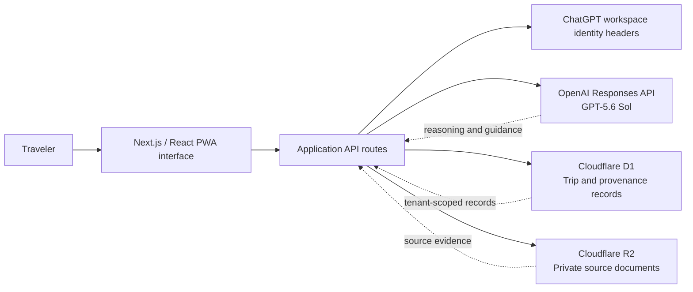

# TripReady

> Upload your bookings. Get a realistic, conflict-free trip that adapts when plans change.

TripReady is a mobile-first travel operations workspace. It turns fragmented confirmations into one dependable itinerary, adds real-world transfer buffers and time-zone context, surfaces uncertain details for review, and helps a traveler understand what must change when a delay affects the plan.

This repository contains a polished, interactive MVP built for a fictional five-day London trip. The demo works without external credentials; adding an OpenAI API key activates the GPT-5.6 Sol travel assistant.


## Submission links

- **Code repository:** `<PASTE_YOUR_GITHUB_REPOSITORY_URL_HERE>`
- **Demo video:** `<PASTE_YOUR_DEMO_VIDEO_URL_HERE>`
- **Codex session ID:** `019f7e42-272c-7282-8fd5-01a69bc1888a`
- **Feedback command:** `/feedback 019f7e42-272c-7282-8fd5-01a69bc1888a`
- **Detailed submission copy:** [SUBMISSION.md](SUBMISSION.md)
- **Testing and recording script:** [docs/DEMO_VIDEO.md](docs/DEMO_VIDEO.md)

## The problem

Travel plans are usually scattered across airline emails, hotel PDFs, ticket screenshots, maps, notes, and group chats. A basic itinerary lists reservations, but it rarely answers the operational questions that determine whether a trip actually works:

- Is there enough time for immigration, baggage, and the airport transfer?
- Is an attraction scheduled before hotel check-in?
- Did a time-zone conversion move a booking to the wrong date?
- Is a confirmation uncertain or associated with the wrong traveler?
- What is affected when a flight is delayed?
- Which tickets and codes must remain available when connectivity is poor?

TripReady treats those details as first-class trip data instead of leaving them for the traveler to reconcile manually.

## What the MVP demonstrates

- A responsive overview with trip health, confirmed records, source-linked documents, and schedule warnings
- A chronological itinerary containing transfers, buffers, local context, and fixed reservations
- Human review of low-confidence extracted values before confirmation
- Conflict explanation and a safe recommended fix
- A three-hour flight-delay simulation with impact analysis and a revised plan
- A simplified mobile travel mode for the next action, confirmation code, directions, and morning brief
- A travel wallet, packing checklist, and budget view
- Calendar export and read-only sharing interactions
- Optional GPT-5.6 Sol assistance through the OpenAI Responses API
- Production-oriented D1/R2 bindings, Drizzle schema, migration, and workspace identity helper

The current MVP intentionally uses fictional seeded trip data for a reliable demonstration. It does not purchase, cancel, check in, send messages, or modify an external reservation. The import interaction demonstrates the review workflow; production OCR, file ingestion, provider APIs, and database route handlers are extension points rather than completed integrations.

## Architecture



### Application layers

1. **Presentation layer** — `app/tripready-app.tsx` contains the responsive product experience and user-driven demo state. `app/globals.css` provides the design system and adaptive layouts.
2. **Server boundary** — `app/page.tsx` reads optional authenticated workspace identity and supplies safe display data to the client component.
3. **AI orchestration boundary** — `app/api/assistant/route.ts` validates input, supplies a bounded itinerary snapshot, calls the Responses API, and returns only the assistant answer.
4. **Persistence model** — `db/schema.ts` defines tenant-owned trips, private source-document metadata, reservations, and per-field provenance/confidence records.
5. **Infrastructure layer** — Vinext generates Cloudflare Worker-compatible output. `.openai/hosting.json` declares logical D1 and R2 bindings; `worker/index.ts` is the runtime entry point.

## Design patterns and key decisions

### Human-in-the-loop approval

Low-confidence information is never silently accepted. External changes remain proposals until the traveler explicitly approves them. The delay simulation reinforces this by stating that applying the revised itinerary does not cancel or modify a provider booking.

### Provenance-first records

The data model stores extracted values separately from their source evidence. Every reservation field can retain a source document, page or excerpt, confidence score, review requirement, and reviewer identity.

### Time zones as domain data

Reservations keep the original local value, IANA time-zone identifier, and normalized UTC value. This avoids silently overwriting the time printed on a ticket and supports daylight-saving and midnight-crossing tests.

### Server/client separation

Identity and API credentials stay on the server. The browser sends only the traveler question and current demo state; it never receives the OpenAI API key.

### Graceful degradation

When `OPENAI_API_KEY` is absent, the assistant route returns a deterministic, clearly labeled demo response. This makes judging and screen recording reliable while preserving a real GPT-5.6 integration path.

### Safety by construction

The assistant prompt forbids invented confirmation numbers, unsupported live status, and claims of external side effects. `AGENTS.md` makes these rules durable for future Codex work in the repository.

## Technology stack

| Area | Technology | Role |
| --- | --- | --- |
| Frontend | Next.js 16, React 19, TypeScript | App Router UI and responsive interactions |
| Styling | Tailwind CSS pipeline + product-specific CSS | Design tokens, layout, mobile adaptation |
| Runtime | Vinext, Vite, Cloudflare Workers | Worker-compatible production build |
| AI | OpenAI Responses API, `gpt-5.6-sol` | Travel reasoning and concise itinerary answers |
| Data | Cloudflare D1, Drizzle ORM, SQLite migrations | Tenant-owned trips and provenance records |
| Files | Cloudflare R2 | Intended private storage for uploaded confirmations |
| Authentication | ChatGPT workspace identity headers / SIWC helper | Optional user identity without client-trusted ownership |
| Validation | Node test runner, ESLint, TypeScript | Rendered-product and architecture invariant checks |
| Development | Codex | Scaffolding, implementation, schema design, testing, review, and documentation |

## GPT-5.6 usage

The live integration is in `app/api/assistant/route.ts`.

- Model: `gpt-5.6-sol` by default, configurable with `OPENAI_MODEL`
- API: OpenAI Responses API
- Reasoning effort: `medium`
- Response verbosity: `low`
- Storage: `store: false`
- Input: a bounded itinerary snapshot, delay state, authenticated user identifier, and traveler question
- Guardrails: no invented booking facts, legal/visa decisions, or claims that an external action occurred

GPT-5.6 is used for the part ordinary rules handle poorly: explaining why a plan is unrealistic, identifying which items a change affects, and communicating a safe next action. Deterministic calculations and verified provider facts should remain outside the model in production.

## How Codex accelerated the project

Codex converted the product brief into a working repository in one core session. It accelerated:

- Vinext/Next.js project scaffolding and dependency setup
- The complete responsive product interface and interaction flow
- A provenance- and time-zone-aware Drizzle schema plus migration
- The GPT-5.6 Responses API route and safe credential boundary
- Durable repository rules in `AGENTS.md`
- Build troubleshooting on Windows and Cloudflare-compatible validation
- Product-specific render tests, lint checks, and migration inspection
- The branded social preview and submission documentation

Key decisions made with Codex included narrowing the demonstration to a fictional London trip, using a deterministic fallback for judge reliability, choosing explicit local/IANA/UTC time fields, separating field provenance from reservation rows, and keeping all external reservation actions approval-gated.

## Prerequisites

- Node.js `>=22.13.0`
- npm 10 or later
- Optional: an OpenAI API key for live GPT-5.6 answers

## Setup

```bash
git clone <YOUR_REPOSITORY_URL>
cd NewpROJ
npm install
```

Create a local environment file:

```bash
copy .env.example .env.local
```

On macOS or Linux, use `cp .env.example .env.local` instead.

To enable live GPT-5.6, edit `.env.local`:

```dotenv
OPENAI_API_KEY=your_key_here
OPENAI_MODEL=gpt-5.6-sol
```

Never commit `.env.local` or show the API key during a recording.

## Run locally

For the most reliable local demo:

```bash
npm run dev
```

Open [http://localhost:3000](http://localhost:3000).

To exercise the Cloudflare-compatible local runtime instead:

```bash
npm run dev:cloudflare
```

## Validate

```bash
npm run typecheck
npm run lint
npm test
```

`npm test` creates the production Vinext build and runs the rendered-product and architecture-invariant tests.

After changing `db/schema.ts`, generate and inspect a migration:

```bash
npm run db:generate
```

## Sample data

The `demo-data/` directory contains fictional confirmations designed for the recording:

- `flight-confirmation.txt`
- `hotel-confirmation.txt`
- `train-confirmation.txt`
- `museum-confirmation.txt`
- `restaurant-confirmation.txt`
- `expected-extraction.json`

The fastest import demonstration is to paste the contents of `museum-confirmation.txt` into the import dialog.

## Recommended demo path

1. Show the overview and explain the trip-health score.
2. Resolve the impossible museum timing.
3. Confirm the low-confidence hotel checkout field and point to its source.
4. Import the sample museum confirmation.
5. Ask, “What should I do next?” and explain whether the response is live GPT-5.6 or demo mode.
6. Simulate a three-hour delay and apply the revised plan.
7. Open travel mode, the wallet, budget, and packing views.
8. Show the GPT route, schema, `AGENTS.md`, tests, and Codex session.

See [docs/DEMO_VIDEO.md](docs/DEMO_VIDEO.md) for a timed narration script.

## Security and privacy notes

- Uploaded travel documents belong in private object storage, not public assets.
- All trip, document, and reservation queries must be scoped by server-derived tenant identity.
- Source download links should be short-lived and signed.
- The model must not make visa, legal, health, entry, purchase, cancellation, or check-in decisions.
- Production deployments should add retention controls, full deletion workflows, audit logs, and provider adapters with confirmed production access.

## Current MVP boundaries

- UI workflows and calendar export are functional.
- The assistant calls GPT-5.6 when configured and otherwise uses a deterministic fallback.
- D1/R2 bindings, schema, and migrations are ready, but CRUD/upload route handlers are not completed.
- Map and routing data are visual demo data rather than live Google API results.
- Share uses a demonstration read-only URL rather than a persisted public share record.
- No external booking is purchased, cancelled, messaged, or modified.

## License

Created as a project submission/demo. Add the license required by your submission platform before publishing publicly.
