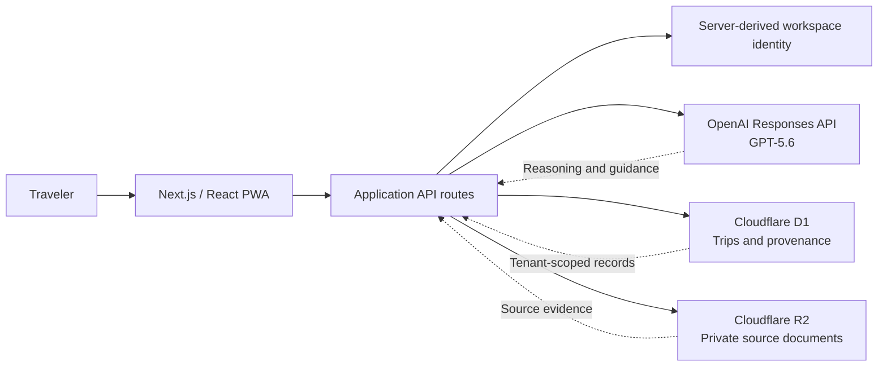
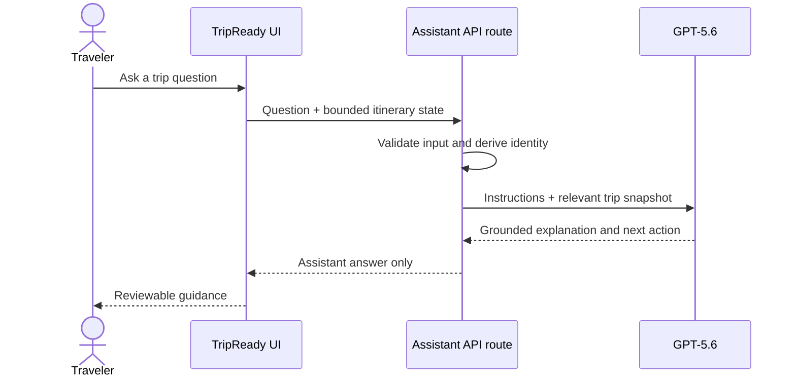

# TripReady-AI

> **Upload your bookings. Get a realistic, conflict-free trip that adapts when plans change.**


TripReady is a mobile-first travel operations workspace built with **Codex** and powered by **GPT-5.6** through the OpenAI Responses API. It converts fragmented booking confirmations into one reviewable itinerary, adds operational context such as transfers and time zones, detects schedule risks, and helps the traveler re-plan safely when a delay affects the trip.

The current repository is a polished, interactive MVP centered on a fictional five-day London trip. It is designed to be easy to run for reviewers: the core demo works without external credentials, while an OpenAI API key enables the live TripReady assistant.

## At a glance

| Item | Details |
| --- | --- |
| Track | Apps for your life |
| Product type | Mobile-first travel operations PWA |
| AI runtime | OpenAI Responses API with GPT-5.6 |
| Development workflow | Codex-assisted product design, implementation, testing, review, and documentation |
| Demo mode | Fully usable with fictional seeded data and no API key |
| Live AI mode | Enabled by adding `OPENAI_API_KEY` |
| Production target | Cloudflare Workers with D1 and R2 |

## The problem

Travel plans are fragmented across airline emails, hotel PDFs, ticket screenshots, maps, notes, and chats. Even after a traveler manually collects everything, a conventional itinerary usually lists reservations without answering the operational questions that determine whether the trip actually works:

- Is there enough time for immigration, baggage collection, and an airport transfer?
- Does a hotel check-in or checkout constraint invalidate part of the day plan?
- Did a time-zone conversion move a reservation to the wrong date?
- Is an extracted value uncertain, outdated, or linked to the wrong traveler?
- What is affected when a flight or train is delayed?
- Which tickets, addresses, and confirmation codes must remain available offline?

TripReady treats these concerns as first-class trip data rather than leaving the traveler to reconcile them manually.

## The solution

TripReady brings the traveler’s bookings into one dependable workspace and creates a realistic timeline with source evidence, local time-zone context, transfers, buffers, and review states. It then explains conflicts in plain language and proposes safe alternatives. Any consequential change remains a proposal until the traveler explicitly approves it.

### MVP capabilities

- Responsive trip overview with health indicators, confirmed records, review items, and conflict warnings
- Chronological itinerary with fixed bookings, transfer segments, and operational buffers
- Human review of low-confidence extracted values before confirmation
- Source-linked reservation fields and document provenance
- Conflict explanation with a safe recommended adjustment
- Three-hour flight-delay simulation with impact analysis and a revised plan
- Simplified travel mode showing the next action, directions, hotel details, and confirmation codes
- Travel wallet, packing checklist, and budget view
- Calendar export and read-only trip-sharing interactions
- Optional GPT-5.6 travel assistance through the OpenAI Responses API
- Production-oriented Cloudflare D1/R2 bindings, Drizzle schema, migration, and identity boundary

## What is real in the MVP

| Capability | Current implementation |
| --- | --- |
| Responsive product interface | Functional |
| Seeded London trip | Functional and fictional |
| Conflict and delay demonstration | Functional in the interactive demo |
| Calendar export | Functional |
| GPT-5.6 assistant | Live when configured; deterministic fallback otherwise |
| Database schema and migration | Implemented for D1/SQLite through Drizzle |
| Cloudflare bindings | Declared for D1 and R2 |
| Production OCR and file ingestion | Extension point; not completed |
| Live maps, routes, and provider status | Demonstration data; not a live provider feed |
| External booking modification | Intentionally not implemented |
| Persisted public sharing | Demonstration interaction only |

This distinction is intentional. The repository demonstrates the product’s reasoning, review, and safety model without claiming that it purchases, cancels, checks in, messages providers, or modifies external reservations.

## Architecture



### Assistant request flow



### Application layers

1. **Presentation layer** — `app/tripready-app.tsx` contains the responsive product experience and interactive demonstration state. `app/globals.css` contains the visual system and adaptive layouts.
2. **Server boundary** — `app/page.tsx` reads optional authenticated workspace identity and passes only safe display data to the client.
3. **AI orchestration boundary** — `app/api/assistant/route.ts` validates the request, constructs a bounded itinerary snapshot, calls the Responses API, and returns the assistant answer without exposing credentials.
4. **Persistence layer** — `db/schema.ts` defines tenant-owned trips, private source-document metadata, reservations, and per-field provenance and confidence records.
5. **Infrastructure layer** — Vinext creates Cloudflare Worker-compatible output. `.openai/hosting.json` declares logical D1 and R2 bindings, and `worker/index.ts` is the runtime entry point.

For additional detail, see [docs/ARCHITECTURE.md](docs/ARCHITECTURE.md).

## Design patterns and key decisions

### 1. Human-in-the-loop approval

Low-confidence information is never silently accepted. Changes to the itinerary remain proposals until the traveler approves them. The delay workflow also makes clear that applying a revised plan does not cancel or modify a provider reservation.

### 2. Provenance-first data modeling

Extracted values are stored separately from source evidence. A reservation field can retain its source document, page or excerpt, confidence score, review requirement, confirmation state, and reviewer identity.

### 3. Time zones as domain data

A reservation retains three representations:

- The original local value printed by the provider
- The IANA time-zone identifier for that location
- A normalized UTC value for comparisons and ordering

This prevents the application from silently overwriting the time printed on a ticket and supports daylight-saving and midnight-crossing tests.

### 4. Server/client security boundary

Identity, database authorization, and API credentials stay on the server. The browser sends only the traveler’s question and the minimum relevant demonstration state; it never receives `OPENAI_API_KEY`.

### 5. Bounded AI context

The model receives a compact, relevant itinerary snapshot instead of unrestricted application or database access. This reduces accidental data exposure, makes prompts easier to evaluate, and limits unsupported conclusions.

### 6. Graceful degradation

When no OpenAI key is configured, the assistant route returns a deterministic response clearly identified as demo behavior. This keeps local setup and judging reliable while preserving a real GPT-5.6 integration path.

### 7. Safety by construction

The assistant instructions prohibit invented confirmation numbers, unsupported live status, legal or visa decisions, and claims that an external side effect occurred. External actions would require separate, explicit tools and user approval in a production implementation.

### 8. Separation of deterministic and generative work

Time arithmetic, identity enforcement, persistence, and verified provider facts belong in deterministic application code. GPT-5.6 is used for ambiguity resolution, impact explanation, conflict reasoning, and traveler-friendly communication.

## Technology stack

| Area | Technology | Purpose |
| --- | --- | --- |
| Frontend | Next.js 16, React 19, TypeScript | App Router UI and responsive interactions |
| Styling | Tailwind CSS pipeline and product-specific CSS | Design tokens, layout, and mobile adaptation |
| Runtime | Vinext, Vite, Cloudflare Workers | Worker-compatible production build |
| AI | OpenAI Responses API, GPT-5.6 | Trip reasoning and concise itinerary guidance |
| Data | Cloudflare D1, Drizzle ORM, SQLite migrations | Tenant-owned trips and provenance records |
| Files | Cloudflare R2 | Intended private storage for uploaded confirmations |
| Authentication | Server-derived ChatGPT workspace identity / SIWC helper | Optional identity without trusting browser-supplied ownership |
| Validation | TypeScript, ESLint, Node test runner | Type, code-quality, and architecture checks |
| Development | Codex | Scaffolding, implementation, testing, review, and documentation |

## Repository structure

```text
.
├── app/
│   ├── api/assistant/route.ts   # GPT-5.6 Responses API boundary
│   ├── globals.css              # Product styles and responsive layouts
│   ├── page.tsx                 # Server-rendered entry and identity boundary
│   └── tripready-app.tsx        # Main interactive product experience
├── db/
│   ├── schema.ts                # Trips, reservations, documents, provenance
│   └── migrations/              # Versioned database migrations
├── demo-data/                   # Fictional, sanitized booking samples
├── docs/
│   ├── ARCHITECTURE.md          # Deeper technical and design explanation
│   └── DEMO_VIDEO.md            # Suggested product-demo sequence
├── public/
│   └── og.png                   # Social preview / project thumbnail
├── tests/                       # Product and architecture invariant tests
├── worker/
│   └── index.ts                 # Cloudflare runtime entry point
├── .env.example                 # Safe environment-variable template
├── .gitignore                   # Files that must not enter source control
├── .openai/hosting.json         # Logical hosting bindings; no credentials
├── AGENTS.md                    # Durable project guidance for Codex
├── package.json
├── package-lock.json
└── README.md
```

Some directories may differ slightly as the project evolves. Keep this map synchronized with the repository before publishing.

## Prerequisites

- Node.js `>=22.13.0`
- npm 10 or later
- Git
- Optional: GitHub CLI for one-command publication
- Optional: an OpenAI API key for live GPT-5.6 answers

## Quick start

### Windows PowerShell

```powershell
git clone <YOUR_REPOSITORY_URL>
Set-Location tripready-ai
npm ci
Copy-Item .env.example .env.local
npm run dev
```

Open `http://localhost:3000`.

### macOS or Linux

```bash
git clone <YOUR_REPOSITORY_URL>
cd tripready-ai
npm ci
cp .env.example .env.local
npm run dev
```

Open `http://localhost:3000`.

If the repository does not yet contain `package-lock.json`, run `npm install` once and commit the generated lockfile. After that, contributors and CI should use `npm ci` for reproducible installs.

## Environment configuration

The application runs in deterministic demo mode without an API key.

To enable the live assistant, edit `.env.local`:

```dotenv
OPENAI_API_KEY=your_key_here
OPENAI_MODEL=gpt-5.6
```

| Variable | Required | Description |
| --- | --- | --- |
| `OPENAI_API_KEY` | No | Enables live assistant answers. Never commit this value. |
| `OPENAI_MODEL` | No | Model alias used by the assistant route. Recommended: `gpt-5.6`. |

Do not expose the API key in a browser-prefixed environment variable, client component, screenshot, demo recording, issue, or commit.

## Run modes

### Standard local development

```bash
npm run dev
```

### Cloudflare-compatible local runtime

```bash
npm run dev:cloudflare
```

### Production validation

```bash
npm run typecheck
npm run lint
npm test
```

`npm test` creates the production Vinext build and runs the rendered-product and architecture-invariant tests defined by the project.

After changing `db/schema.ts`, generate and inspect a migration:

```bash
npm run db:generate
```

Do not commit a generated migration until its SQL has been reviewed.

## Sample data

`demo-data/` contains fictional confirmations created solely for development, testing, and screen recording:

- `flight-confirmation.txt`
- `hotel-confirmation.txt`
- `train-confirmation.txt`
- `museum-confirmation.txt`
- `restaurant-confirmation.txt`
- `expected-extraction.json`

The quickest import demonstration is to paste the contents of `demo-data/museum-confirmation.txt` into the import workflow. It deliberately creates an unrealistic post-arrival museum reservation so the conflict review is easy to demonstrate.

All names, references, dates, and providers in this directory must remain fictional. Never commit real passports, tickets, receipts, addresses, phone numbers, payment details, or live booking references.

## How GPT-5.6 is used

The live integration is isolated in `app/api/assistant/route.ts`.

- **API:** OpenAI Responses API
- **Model:** `gpt-5.6`, configurable through `OPENAI_MODEL`
- **Input:** validated traveler question, bounded itinerary snapshot, delay state, and server-derived user context
- **Output:** concise, reviewable trip guidance
- **Storage:** the route is designed to avoid model-side response storage
- **Guardrails:** no invented booking facts, live provider claims, legal or visa decisions, or claims that an external action was completed

GPT-5.6 handles the parts that deterministic rules handle poorly:

- Explaining why a plan is unrealistic
- Resolving ambiguous references in traveler questions
- Identifying which itinerary items a change affects
- Comparing safe alternatives
- Communicating the next action clearly

It is not the source of truth for live flight status, visa requirements, legal guidance, pricing, or provider availability. Those facts require verified external systems and timestamps in a production release.

## How Codex accelerated the workflow

Codex was used as a software-engineering collaborator, not as an unreviewed code generator. It accelerated the project in the following areas:

| Stage | Codex contribution | Human decision or review |
| --- | --- | --- |
| Product framing | Converted the broad travel-assistant concept into a focused trip-operations MVP | Chose conflict prevention and disruption recovery over generic itinerary generation |
| Scaffolding | Set up the Next.js/Vinext structure and dependencies | Confirmed the Cloudflare deployment direction |
| UI implementation | Built the responsive overview, itinerary, conflict, wallet, packing, and travel-mode flows | Reviewed hierarchy, copy, and demo narrative |
| Data modeling | Proposed the Drizzle schema and migration | Required explicit local/IANA/UTC time fields and per-field provenance |
| AI integration | Implemented the server-side Responses API route | Limited model input, disabled unsupported side effects, and kept credentials server-only |
| Reliability | Added deterministic fallback behavior | Chose reviewer reliability over requiring external credentials |
| Testing | Added type, lint, render, architecture, and migration checks | Reviewed failures and accepted only verified fixes |
| Documentation | Drafted repository guidance, setup instructions, and demo material | Corrected scope claims and documented incomplete integrations honestly |

### Key decisions made during the Codex workflow

1. **Narrow the demo to one fictional London trip.** This creates a dependable narrative and avoids presenting incomplete provider integrations as production functionality.
2. **Keep the assistant optional.** The product remains demonstrable without credentials; a key activates live GPT-5.6 behavior.
3. **Model time explicitly.** Every reservation retains local time, IANA zone, and UTC rather than relying on implicit browser conversion.
4. **Separate provenance from reservation rows.** This makes uncertainty, review, and source evidence visible at field level.
5. **Gate all consequential actions.** The model may explain or propose, but cannot claim that it cancelled, purchased, checked in, or contacted a provider.
6. **Keep AI behind a server boundary.** Credentials, user identity, and authorization never depend on client-supplied ownership.
7. **Make project rules durable with `AGENTS.md`.** Codex receives the project’s test commands, privacy constraints, time-zone rules, and dependency policy at the start of future work.

A public repository may include the Codex session identifier required by a submission platform, but raw session logs should be reviewed for credentials, personal paths, and private content before publication.

## Recommended demo path

1. Open the overview and explain the trip-health score.
2. Open the impossible museum timing and show the source of the conflict.
3. Confirm the low-confidence hotel checkout field and view its evidence.
4. Import `demo-data/museum-confirmation.txt`.
5. Ask the assistant, “What should I do next?” and identify whether the response is live GPT-5.6 or demo mode.
6. Simulate a three-hour delay and inspect the affected itinerary items.
7. Apply the revised local plan while explaining that no provider booking was modified.
8. Open travel mode, wallet, budget, and packing views.
9. Show `app/api/assistant/route.ts`, `db/schema.ts`, `AGENTS.md`, and the tests.
10. Close with the architecture and current MVP boundaries.

## Security and privacy

- Store uploaded confirmations in private object storage, never under `public/`.
- Scope every trip, document, reservation, and share query by server-derived tenant identity.
- Use short-lived signed URLs for private documents.
- Keep `.env`, `.env.local`, `.dev.vars`, local databases, and provider credentials out of Git.
- Do not log raw travel documents or full confirmation numbers.
- Redact sensitive fields from telemetry and error reports.
- Require explicit approval before any external write operation.
- Add retention controls, account export, and complete deletion workflows before accepting real traveler data.
- Treat visa, health, legal, entry, pricing, and provider-status information as externally verified facts, not model-generated truth.

## Current MVP boundaries

- The interface, local demo flows, and calendar export are functional.
- The assistant calls GPT-5.6 when configured and otherwise uses a deterministic fallback.
- D1/R2 bindings, schema, and migrations are prepared, but production CRUD and upload routes are not complete.
- Maps, transfer estimates, and status information are demonstration data rather than live provider results.
- Read-only sharing is a demonstration interaction rather than a persisted public-share record.
- No external reservation is purchased, cancelled, checked in, messaged, or modified.

## Roadmap

- Complete tenant-scoped trip and reservation CRUD routes
- Add private R2 uploads with validation, malware scanning, and signed retrieval
- Add structured extraction with field-level confidence and provenance
- Integrate verified routing and travel-status providers behind adapters
- Persist read-only share links with expiry and revocation
- Add offline encrypted document access
- Expand evaluation fixtures for time zones, delays, duplicate bookings, and ambiguous confirmations
- Add observability, rate limiting, audit logs, data retention, and deletion controls

## Contributing

Before opening a pull request:

```bash
npm run typecheck
npm run lint
npm test
```

Read `AGENTS.md` before making changes. Preserve the project’s approval, provenance, time-zone, authorization, and privacy invariants.

## Submission links

- **Public repository:** `<PASTE_GITHUB_REPOSITORY_URL>`
- **Demo video:** `https://youtu.be/zozG20Nfpx8`
- **Codex session ID:** `019f7e42-272c-7282-8fd5-01a69bc1888a`
- **Codex feedback command:** `/feedback 019f7e42-272c-7282-8fd5-01a69bc1888a`

Remove any link or identifier that is not required by the submission platform before general publication.

## License

No open-source license is included in this starter package. Add a `LICENSE` file before publication if you want others to be able to use, modify, or redistribute the code. MIT is a simple permissive option; Apache-2.0 adds an explicit patent grant. Choose the license that matches your intent.

---

Built with Codex. Powered by GPT-5.6. Designed to make a trip operationally realistic, not merely attractive on paper.

