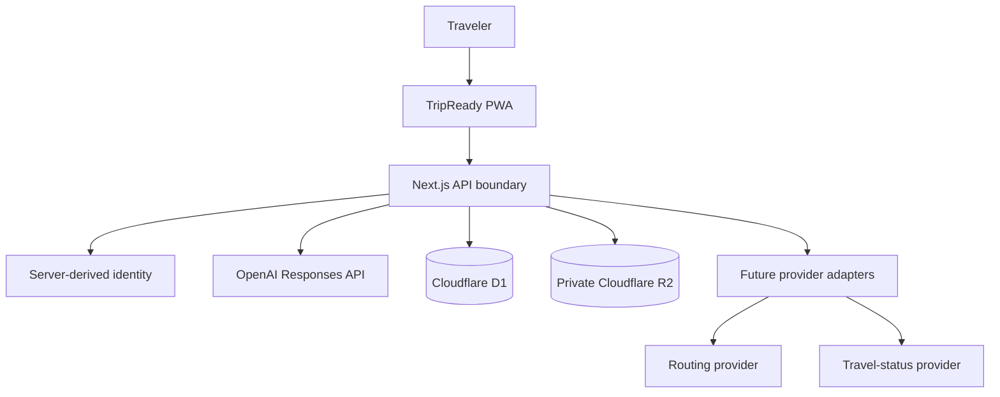

# TripReady architecture and design

## System objective

TripReady converts fragmented booking evidence into a tenant-scoped, provenance-aware trip model. It then combines deterministic schedule checks with GPT-5.6 reasoning to explain conflicts and propose safe, reviewable alternatives.

## Context diagram



## Component responsibilities

### Presentation

- Render the trip timeline, review queue, conflicts, wallet, packing, budget, and travel mode.
- Collect user intent and approval.
- Never make authorization decisions based on browser-supplied ownership.
- Never expose provider or OpenAI credentials.

### Application API

- Validate input and output.
- Resolve the authenticated tenant or workspace identity.
- Load only records the tenant owns.
- Prepare bounded model context.
- Record approved changes and audit events.
- Keep side-effecting integrations behind explicit tools and approval gates.

### AI orchestration

- Explain conflicts and affected reservations.
- Interpret ambiguous traveler questions.
- Rank safe alternatives using supplied facts.
- Avoid inventing status, prices, codes, or provider actions.
- Return reviewable guidance rather than mutating the trip directly.

### Persistence

Conceptual entities:

```text
User / tenant
  └── Trip
      ├── Traveler
      ├── SourceDocument
      ├── Reservation
      │   └── ReservationFieldProvenance
      ├── ItinerarySegment
      ├── Conflict
      ├── ProposedChange
      └── AuditEvent
```

A production query should always include tenant scope at the repository or service boundary rather than relying on the caller to remember it.

### Private document storage

R2 is intended for original source documents. The database stores metadata and an object key, not a public URL. Downloads should use short-lived signed links and authorization should be re-checked before issuing a link.

## Time model

Each time-bearing reservation should preserve:

```text
original_local_text
local_datetime
iana_time_zone
utc_datetime
source_document_id
confidence
review_status
```

Rules:

- Never silently replace a provider’s printed local time.
- Use UTC for ordering and cross-zone comparisons.
- Use the IANA zone for display and daylight-saving calculations.
- Add tests for midnight crossings, daylight-saving changes, and incomplete zone information.

## Provenance model

A field-level provenance record should capture:

```text
reservation_id
field_name
normalized_value
source_document_id
source_locator
source_excerpt
confidence
requires_review
reviewed_by
reviewed_at
```

This structure supports a “view source” interaction and prevents a generated value from appearing indistinguishable from a confirmed provider fact.

## Conflict engine

Use deterministic checks first:

- Overlap between fixed reservations
- Transfer duration plus minimum buffer
- Check-in or checkout constraint
- Missing accommodation night
- Passenger mismatch
- Duplicate or superseded confirmation
- Invalid time-zone ordering

GPT-5.6 may explain a conflict or compare alternatives, but the model should not be the only component deciding that two time ranges overlap.

## AI request design

The assistant route should send only:

- The traveler’s validated question
- Relevant trip dates and fixed items
- Known conflicts and uncertainty states
- Delay simulation state
- Safe user context derived on the server

It should not send unrelated documents, raw credentials, complete logs, or another tenant’s records.

Recommended response policy:

- State assumptions.
- Distinguish confirmed facts from suggestions.
- Acknowledge missing evidence.
- Do not claim external completion.
- Ask for approval through the UI before any future write tool is called.

## Design patterns

### Human-in-the-loop

The user confirms uncertain extraction and consequential changes.

### Provenance-first records

Every important generated or extracted field retains evidence and confidence.

### Ports and adapters

Future mapping, flight-status, hotel, calendar, email, and notification providers should implement internal interfaces so the core domain is not coupled to one vendor.

### Server-side orchestration

Credentials, identity, model calls, and provider tools are isolated from client components.

### Graceful degradation

The product remains demonstrable when the model or an external provider is unavailable.

### Auditability

Approved changes and attempted side effects should create immutable audit events with actor, timestamp, input, result, and idempotency key.

## Deployment shape

```text
Cloudflare Worker
  ├── Next.js/Vinext application
  ├── D1 binding
  ├── R2 binding
  └── server-side OpenAI call
```

Production additions should include rate limiting, structured telemetry, error reporting with redaction, audit storage, retention jobs, signed document access, and provider-specific retry queues.

## Security boundaries

- Browser input is untrusted.
- Model output is untrusted until schema-validated and policy-checked.
- Source documents may contain prompt-injection text and must be treated as data, not instructions.
- External writes require explicit user approval and idempotency.
- Provider responses require validation and timestamps.
- Secrets stay in platform-managed environment variables.

## Testing strategy

- Unit tests for time conversion and conflict rules
- Schema tests for AI and API payloads
- Tenant-isolation tests
- Route tests for missing key, model error, and invalid input
- Migration inspection
- Render tests for the product’s critical states
- End-to-end tests for review, conflict resolution, delay simulation, and calendar export
- Evaluation fixtures for assistant accuracy and unsupported-claim prevention
